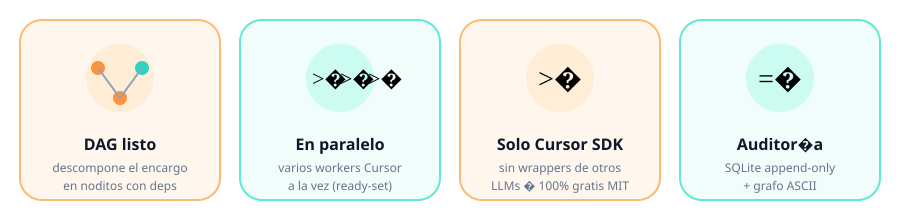

<p align="center">
  
</p>

<h1 align="center">Anne Agent ✦</h1>

<p align="center">
  <strong>Un encargo en lenguaje natural → un DAG de agentes Cursor en paralelo.</strong>
</p>

<p align="center">
  <a href="./LICENSE"></a>
  <a href="https://nodejs.org/"></a>
  <a href="https://www.typescriptlang.org/"></a>
  <a href="https://cursor.com/docs/sdk/typescript"></a>
  <a href="https://github.com/gonzalolinaresamezcua/anne-agent"></a>
  
</p>

CLI multiagente **open-source y gratis (MIT)** al estilo [AITarea](https://aitarea.com). Anne planifica, ejecuta, verifica y audita usando **exclusivamente el [Cursor SDK](https://cursor.com/docs/sdk/typescript)** — sin wrappers de otros LLMs.

```bash
anne run "Crea un CLI hello-world en TypeScript en ./demo y añade tests"
```

<p align="center">
  
</p>

---

## Qué trae Anne

<p align="center">
  
</p>

| Problema | Qué hace Anne |
|---|---|
| Un agente solo se atasca en encargos grandes | Descompone el objetivo en un **DAG** de subtareas |
| Ejecutar todo en serie es lento | Lanza **workers Cursor en paralelo** (ready-set) |
| No sabes qué pasó | Deja **auditoría** append-only en SQLite + grafo ASCII |
| Quieres el mismo cerebro que Cursor | Usa **solo** `@cursor/sdk` (local runtime) |

**100% gratis · MIT · Linux · TypeScript · Cursor SDK**

---

## Pipeline (fases AITarea)

<p align="center">
  
</p>

1. **Describe** 📝 — objetivo del usuario  
2. **Analyze** 🔍 — clasificación y riesgos  
3. **Plan** 🗺️ — DAG JSON (`nodes[]` con deps y acceptance)  
4. **Execute** ⚡ — workers Cursor en paralelo (ready-set)  
5. **Verify** ✅ — QA; puede reabrir nodos fallidos  
6. **Deliver** 🎁 — resumen + memoria  

---

## Requisitos

- Linux
- Node.js ≥ 22.13
- `CURSOR_API_KEY` ([dashboard de Cloud Agents de Cursor](https://cursor.com/dashboard))

## Instalación

```bash
git clone https://github.com/gonzalolinaresamezcua/anne-agent.git
cd anne-agent
npm install
npm run build
npm link   # opcional: expone el binario `anne`
```

## Uso rápido

```bash
export CURSOR_API_KEY=cursor_...

anne init
anne models
anne run "Crea un CLI hello-world en TypeScript en ./demo y añade tests"
anne graph
anne audit
```

REPL interactivo:

```bash
anne
anne> /help
anne> Crea un README breve en ./notas
```

## Conceptos

| Concepto | Significado |
|---|---|
| Encargo | Objetivo en lenguaje natural |
| Nodo | Subtarea del DAG |
| Skill | Procedimiento `SKILL.md` inyectado al prompt |
| Memoria | `~/.anne/memory/MEMORY.md` + `USER.md` |
| Auditoría | Log append-only en SQLite |

## Comandos

| Comando | Descripción |
|---|---|
| `anne` | REPL |
| `anne run "…"` | Pipeline completo |
| `anne status [id]` | Estado |
| `anne graph [id]` | DAG ASCII |
| `anne audit [id]` | Auditoría |
| `anne models` | Catálogo `Cursor.models.list()` |
| `anne model [id]` | Ver/fijar modelo default |
| `anne skills` | Skills cargadas |
| `anne memory` | Ver memoria |
| `anne list` | Encargos recientes |
| `anne init` | Crea `~/.anne` |

Slash en REPL: `/help`, `/stop`, `/new`, `/status`, `/graph`, `/audit`, `/models`, `/model`, `/skills`, `/memory`, `/quit`.

## Configuración

`~/.anne/config.json`:

```json
{
  "apiKeyEnv": "CURSOR_API_KEY",
  "defaultModel": "auto",
  "plannerModel": "auto",
  "workerModel": "auto",
  "verifierModel": "auto",
  "maxParallel": 3,
  "maxVerifyRetries": 1,
  "approval": "auto",
  "stream": true
}
```

Home override: `ANNE_HOME=/ruta`.

## Cerebro: solo Cursor SDK 🧠

Anne **no** envuelve OpenAI, Anthropic ni otros proveedores. El runtime es Cursor:

- Modelos vía `Cursor.models.list()` (sin hardcode frágil; fallback `auto`)
- Runtime `local: { cwd }`
- Roles: planner / worker / verifier con selección de modelo configurable
- Dispose garantizado; distingue errores de arranque vs run

Docs: [cursor.com/docs/sdk/typescript](https://cursor.com/docs/sdk/typescript)

## Desarrollo

```bash
npm run anne -- models
npm test
npm run typecheck
```

## Contribuir

Issues y PRs bienvenidos. Ideas útiles: más skills, exportación del DAG, demos, empaquetado npm.

Si Anne te sirve, **una ⭐** ayuda muchísimo a que más gente la descubra.

## Licencia

[MIT](./LICENSE) — gratis para uso personal y comercial.

Hecho con ✦ por [digitacode.es](https://digitacode.es)
